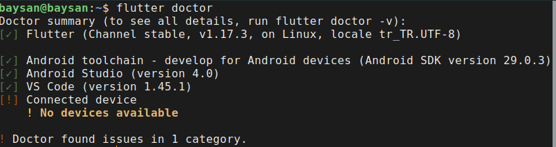

# İçindekiler
- [İçindekiler](#i̇çindekiler)
- [Giriş](#giriş)
- [Flutter Nedir?](#flutter-nedir)
  - [Güzel Özellikleri](#güzel-özellikleri)
    - [Dart Dili](#dart-dili)
    - [Cross Platform](#cross-platform)
    - [Hot Reloading](#hot-reloading)
    - [Material Widget](#material-widget)
    - [Custom Widget](#custom-widget)
- [Bazı Flutter CLI Komutları](#bazı-flutter-cli-komutları)
  - [Doctor](#doctor)
  - [Create](#create)
  - [Run](#run)
  - [Devices](#devices)
  - [Emulators](#emulators)

# Giriş
Bu repoda Flutter'a dair notlarımı paylaşmaya çalışacağım.

# Flutter Nedir?
Google tarafından open-source olarak geliştirilen, Google'ın kendi dilin olan [Dart](https://dart.dev/) üzerine kurulmuş olan cross platform native uygulamalar geliştirebilmemizi sağlayan SDK'dir.
## Güzel Özellikleri
### Dart Dili
Diğer programlama dillerine benzerlik gösteren Dart'a adapte olmak oldukça kolaydır. Hiç programlama dili bilmeyenler için ise öğrenmesi oldukça kolaydır.
### Cross Platform
Yazdığımız tek bir projeyi hem iOS hem de Android platformlarında çalıştırabiliriz.
### Hot Reloading
Geliştirme esnasında yazdığımız kodların çıktısını anında görebiliyoruz. Bu sayede herhangi bir kodu değiştirdiğimizde ilgili state bozulmadan güncel kodun çıktısını görebiliyoruz.
### Material Widget
Flutter'ın kendisine ait hazır Material Widget'ları sayesinde çok hızlı bir şekilde material dizayna sahip uygulamalar çıkarabiliriz.
### Custom Widget
İstediğimiz kadar custom widget oluşturabiliriz. Flutter'ın oldukça hızlı render motoruna sahip olması sebebiyle iç içe istediğimiz kadar custom widget ekleyebiliriz.

# Bazı Flutter CLI Komutları
## Doctor
`flutter doctor` komutu ile makinemizde yüklü olan flutter'a dair gerekli konfigürasyonların varlığını sorgulayabilir ve atılması gereken adımları görebiliriz.

## Create
`flutter create <proje_adi>` parametre olarak verilen proje adında standart bir Flutter başlangıç projesi oluşturur.

## Run
`flutter run` bir üst başlıktaki komut ile oluşturduğumuz proje dizinine girerek bu komutu çalıştırırsak Flutter projemiz çalışacaktır.
## Devices
`flutter devices` komutu ile bağlı/kullanılabir emülatörleri/cihazları listeler
## Emulators
`flutter emulators`  komutu ile kullanılabilir emülatörleri listeler.  
`flutter emulators --launch <emulator_id>` komutu ile listeden seçtiğimiz emülatörü başlatır
